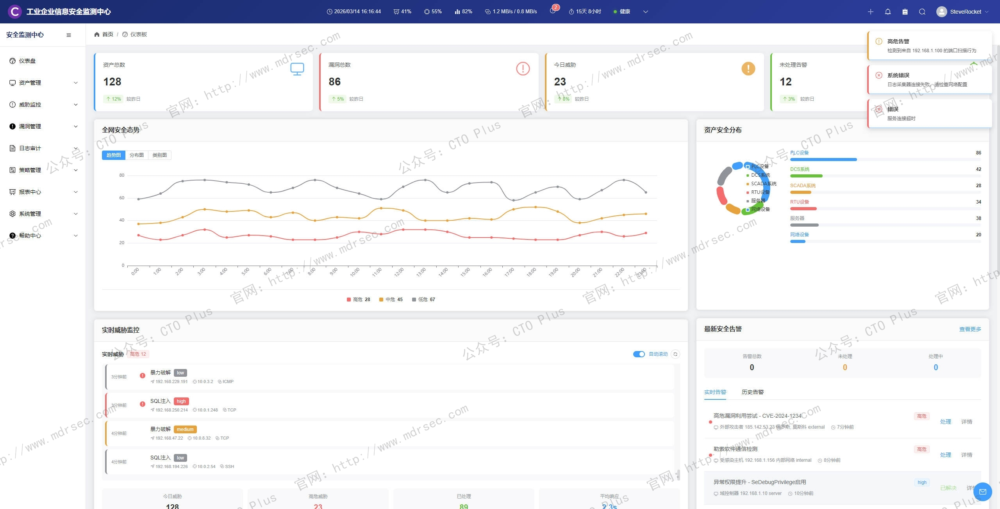
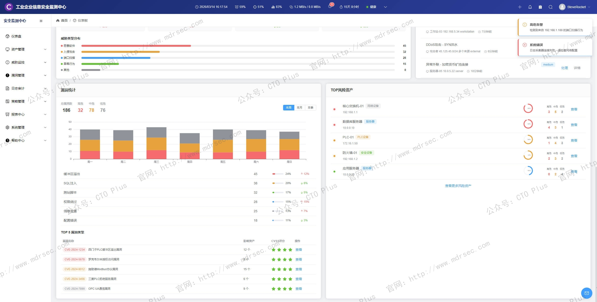

# 工业企业信息安全监测中心（IoT SOC）

## 关于我们

- 官网： http://www.mdrsec.com

我们的技术文章和产品概述欢迎浏览我们的门户。

- 公众号：CTO Plus

最新的动态欢迎关注我们官方唯一公众号。


- 作者QQ

更详细更具体的需求，或者项目合作，或者问题 欢迎联系我。


- QQ群

我们官方组建的QQ群，如果您有兴趣也可以加入我们。


- 请喝咖啡

如果感兴趣，也可以请我喝杯咖啡


## 产品核心功能模块




传统企业SOC主要面向IT系统（服务器、网络设备、数据库等），而工业企业的OT环境（PLC、DCS、SCADA、RTU、智能仪表、机器人等）具有**协议私有化、实时性要求极高、系统更新困难、物理影响大**等特点。一旦遭受攻击，可能导致停产、设备损毁甚至安全事故。因此，我们在企业实践过程中开发了 工业企业信息安全监测中心（IoT SOC，Industrial IoT Security Operations Center，即工业物联网安全运营中心），我们的系统并非简单复用IT SOC，而是围绕工业资产、工业协议、工业行为、工业风险构建的一体化监测与响应平台。

这里我将为大家分享下我们在实际工业客户环境自研的 工业企业信息安全监测中心（IoT SOC，Industrial IoT Security Operations Center，即工业物联网安全运营中心）功能特点

---

## 核心功能模块

### 1. 工业资产可视化与资产管理

**功能描述**  
自动发现并持续跟踪OT网络中的所有联网设备，包括控制器、网关、HMI、上位机、智能传感器等，构建动态资产清单。

**具体能力**  
- 无源/低影响资产探测：基于主动探测（低频率扫描）与被动监听（镜像流量分析）结合，避免影响生产稳定性  
- 资产指纹库：识别设备型号（如西门子S7-1500、罗克韦尔ControlLogix）、固件版本、MAC/IP、开放端口、运行的工业协议  
- 资产分组与拓扑：按产线、车间、工艺段、安全域自动分组，生成网络连接拓扑图  
- 变更检测：新设备接入、配置变更、非法外联实时告警  
- 漏洞关联：将资产与CVE、CNVD及特定工控漏洞库（如ICS-CERT）关联，标注高风险设备  

**工业特性**  
支持离线环境资产识别，不依赖云端查询；支持长周期静默资产（如半年不通信的PLC）仍纳入管理。

---

### 2. 工业协议与行为基线

**功能描述**  
解析数十种工业协议（Modbus/TCP、Profinet、Ethernet/IP、OPC DA/UA、S7comm、DNP3、IEC 60870-5-104、IEC 61850等），建立设备/用户/功能的正常行为基线。

**具体能力**  
- 协议白名单：允许的指令类型（如只读、禁止下载程序）、寄存器范围、数据值合法性  
- 指令级审计：记录谁（源IP、登录名）在什么时间向哪个PLC的哪个寄存器写了什么值  
- 行为建模：学习正常周期性（如每5秒读取压力值）、突发性（紧急停机指令）行为模式  
- 异常检测：偏离基线超过阈值（如半夜批量修改设定点、非常见功能码调用）触发告警  
- 深度包检测（DPI）：识别隐蔽隧道、恶意payload嵌入正常协议字段  

**工业特性**  
支持响应时间要求（<1ms级协议不被解码引入延迟）；支持非IP化串行链路（RS485/Modbus RTU）通过工业网关接入。

---

### 3. 融合威胁检测（IT + OT）

**功能描述**  
同时检测传统IT威胁（勒索软件、钓鱼、横向移动）与OT特有威胁（固件篡改、恶意逻辑、状态篡改），避免单点检测盲区。

**具体能力**  
- 入侵检测（IDS/IPS）：集成Snort/Suricata规则库 + 工控特定规则（如S7协议写保护绕过）  
- 工业恶意软件检测：识别针对ICS的已知样本（Havex、Trisis、Industroyer）及变种  
- 用户实体行为分析（UEBA）：分析工程师站、HMI、历史库服务器的异常登录、权限提升  
- 网络流量分析（NTA）：发现C2通信、DGA域名、异常外联（如PLC主动访问外网）  
- 联动工控防火墙/EDR：接收端点告警（如工程师站杀毒报毒），结合网络侧行为关联分析  

**工业特性**  
支持低带宽、高延迟环境下的轻量级检测代理；可在生产大区（区域1/2）部署纯被动监测模式，不阻断生产。

---

### 4. 实时风险与漏洞优先级评估

**功能描述**  
基于资产重要性、暴露面、可利用性、现有补偿措施，对检测到的漏洞和威胁进行风险优先级排序，指导有限资源下的处置。

**具体能力**  
- 漏洞扫描适配OT：支持非侵入式扫描（利用镜像流量识别开放服务，而非主动漏洞探测包）  
- 虚拟补丁建议：对无法立即修复的PLC固件漏洞，推荐虚拟补丁（如防火墙策略、协议白名单）  
- 攻击路径模拟：展示攻击者从IT跳板机到OT关键设备的可能路径  
- 量化风险评分：例如 CVSS + 业务影响因子（该PLC控制反应釜，停产损失10万元/小时）  

**工业特性**  
识别“不安全配置”（如默认密码未改、调试口开启）为重大风险；支持基于工单的修复闭环管理。

---

### 5. 统一告警与事件管理（SIEM）

**功能描述**  
集中收集来自工业防火墙、防病毒、日志服务器、PLC审计日志、传感器等数据源的告警，进行降噪、富化、关联、呈现。

**具体能力**  
- 日志标准化：将Modbus记录、Windows事件、Syslog、OPC历史数据转为统一格式  
- 告警聚合与抑制：避免风暴（如数千次端口扫描聚合成一条），基于规则静默计划停机期间的告警  
- 事件关联分析：例如“HMI异常登录 + 之后5分钟内PLC程序下载 + 压力设定值被改”组合成“疑似攻击链”  
- 事件工作台：支持状态分配（新建/处置中/已关闭）、调查笔记、证据留存（原始报文）  
- 合规报告：自动生成满足国家关键信息基础设施（CII）、等保2.0（工业扩展要求）、ISO 27001、NIST CSF的报告  

**工业特性**  
支持离线部署（无互联网连接）；支持告警源地理位置标注（厂区地图）；提供“生产窗口模式”——在批量生产期间降低部分告警敏感度。

---

### 6. 响应与处置（SOAR增强）

**功能描述**  
针对已确认的工业安全事件，提供预定义或编排化的响应动作，并最小化对生产的影响。

**具体能力**  
- 响应剧本（Playbook）：例如“PLC程序非法下载” → ①冻结该PLC端口 ②通知值班工程师 ③备份当前程序 ④比对基线  
- 半自动/手动响应动作：  
  - 网络侧：通过防火墙或交换机ACL隔离危险IP/VLAN  
  - 设备侧：调用PLC的“安全锁定”功能（需厂商接口）  
  - 管理侧：自动创建工单（联动ITSM），发送短信/钉钉/邮件  
- 沙箱取证：捕获攻击期间的网络流量包、PLC内存快照（如支持）  
- 回滚与恢复：协助将PLC程序从备份恢复，验证完整性  

**工业特性**  
**严禁自动化阻断生产** —— 所有阻断动作必须为“手动确认后执行”或“仅限非生产区域”；支持“模拟响应”（Dry-run）测试剧本效果。

---

### 7. 可视化驾驶舱与报表

**功能描述**  
面向不同角色（安全分析师、生产主管、CIO/CISO）提供安全态势视图，支持大屏、PC、移动端。

**具体能力**  
- 整体安全评分：基于资产覆盖率、威胁数量、未处置高危事件等计算  
- 地理/产线视图：在工厂地图上动态显示告警位置、攻击方向  
- 趋势分析：攻击频率、受影响资产类型、月度指标（MTTD/MTTR）  
- 角色化报表：  
  - 生产主管：只看影响生产的告警（如PLC离线、程序变更）  
  - 合规审计：完整的日志取证链  
- 钻取分析：从全局KPI一路下钻到原始告警报文  

**工业特性**  
支持多工厂集团视图（总部统一监控，分厂自主处置）；支持暗色主题（中控室低光环境）。

---

### 8. 第三方系统集成与开放API

**功能描述**  
与企业现有生产管理、安全、运维系统互通，避免信息孤岛。

**具体能力**  
- 对接MES/ERP：获取生产排程信息，用于判断当前行为是否属于计划维护  
- 对接CMDB：自动同步资产信息  
- 对接工单系统（ServiceNow、Jira）：自动创建处置任务  
- 对接态势感知平台：上报OT安全事件至企业级SOC或监管平台  
- RESTful API：支持资产、告警、日志的查询与回调  

**工业特性**  
支持单向数据导出（只读模式），防止外部系统反向操作OT设备；支持OPC UA/Modbus输出自身安全状态（如“IoT SOC健康度”供MES展示）。

---

## 三、关键特性（区别于通用SOC）

### 特性1：对工业生产可用性的绝对尊重
- **被动优先**：默认采用端口镜像、日志被动采集，主动探测需人工授权且限低频  
- **无瞬时影响**：解码器处理延迟控制在微秒级，不允许因安全监测导致PLC通信超时  
- **变更白名单**：允许“计划性异常行为”（如年检时大量下载程序），需提前配置例外窗口  

### 特性2：OT原生解析能力
- **专有协议**：不依赖通用字段，理解功能码、对象ID、死区、时间戳等语义  
- **非IP设备接入**：支持通过串口服务器或网关采集RS232/485链路数据  
- **离线资产指纹**：无需连接厂商云服务即可识别老旧或定制化设备  

### 特性3：隔离网络下的高效运行
- **完全本地化部署**：所有分析引擎、规则库、存储均部署在企业内部（通常位于工业二区或管理大区）  
- **离线更新机制**：通过移动介质或单向导入设备更新威胁情报、漏洞库  
- **自包含时间同步**：不依赖NTP外部服务，采用工业授时（GPS/北斗或PTP）  

### 特性4：与IT SOC的联邦协同
- **单向信息流**：OT SOC向企业SOC推送精简后的安全事件，但不接受来自IT SOC的远程控制指令  
- **统一事件ID**：保持与IT SOC事件格式的映射关系，便于全局溯源  
- **联合调查**：当攻击从IT横向移动到OT时，两个SOC可交换证据链（如IP、时间戳、进程）  

### 特性5：针对工业杀伤链的检测模型
- 基于 **ICS网络杀伤链**（侦察→武器化→交付→利用→安装→C2→目标达成）重新定义检测阶段  
- 例如：  
  - 侦察期 → 非正常端口扫描、Profinet设备枚举  
  - 武器化期 → 恶意梯形逻辑注入  
  - 目标达成期 → 安全仪表系统(SIS)旁路或紧急停机信号  

### 特性6：长周期行为分析
- 工业控制系统行为具有高度规律性，支持**数周甚至数月**的学习周期建立基线  
- 检测慢速威胁：如每天修改设定值0.5%，最终导致产品质量问题  

---

## 四、部署架构（简要）

```
┌─────────────────────────────────────────┐
│           企业管理区（IT SOC）          │
│      （可选，接收精简告警）              │
└─────────────────▲───────────────────────┘
                  │ 单向或受限API
┌─────────────────┴───────────────────────┐
│         IoT SOC 核心平台                 │
│  (资产库、SIEM、SOAR、可视化)           │
└────┬──────────────┬────────────┬────────┘
     │              │            │
  ┌──▼──┐       ┌──▼──┐      ┌─▼───┐
  │采集器│       │采集器│      │采集器│
  │镜像口│       │日志 │      │DB/API│
  └──┬──┘       └──┬──┘      └──┬──┘
     │              │            │
   OT网络1        OT网络2       OT应用服务器
  (PLC/RTU)      (DCS/SCADA)   (Historian)
```

**关键部署原则**：  
- 采集器与核心平台之间采用加密、认证通信  
- 核心平台高可用部署（主备或集群），存储保留至少1年原始日志  
- 每个工厂物理或逻辑独立，集团SOC通过VPN查看统一仪表板  

---

## 最后

我们的工业企业信息安全监测中心（IoT SOC）不仅仅是一个单纯的“监控工具”，而是融合**资产管控、协议解析、威胁检测、风险评级、协同响应**为一体的工业安全运营平台。最本质的特征是：**在保障生产连续性与完整性的前提下，将信息安全能力无感地融入工业环境**。

选择或自建IoT SOC时，请务必验证以下核心能力：  
- 能否解析您工厂实际使用的所有工业协议？  
- 是否提供真实的资产自动发现（而非手动录入）？  
- 是否支持离线运行与离线更新？  
- 响应剧本是否具备“人工确认”安全阀？  
- 能否出具符合国内等保2.0及关键信息基础设施安全保护条例的报告？

工业安全是生产安全的延伸，IoT SOC正是这场融合趋势下最关键的平台型产品。

## 产品清单

### 企业网络安全运营中心产品

- 资产安全配置管理系统（SCMDB）
- 终端侦测与响应系统（EDR）
- 网络侦测与响应系统（NDR）
- 企业网络资产攻击面管理系统（CAASM）
- 资产暴露面管理系统（AEMS）
- 网络安全蜜罐管理系统（HoneyPot）
- 安全事件收集与告警管理系统（SIEM）
- 扩展侦测与响应系统（XDR）
- 多引擎脆弱性扫描系统（VAS）
- 多源日志审计监测系统（LAS）
- 网络安全威胁情报中心（TIS）
- 网络安全漏洞库管理系统（VDBS）
- 网络安全编排与自动化响应（SOAR）
- 威胁狩猎系统（THS）
- 数据库安全审计系统（DSAS）
- AI智能体安全态势管理系统（AISPM）
- Web防火墙（WAF）
- 网站安全监测平台（WSM）
- 网络安全态势感知平台（SSAP）
- 网络安全自动化应急响应工具系统（NSRT）
- 企业网络安全运维工具系统（SecTools）
- 网络安全自动化等保测评系统（ASES）
- 浏览器安全监测防护系统（BSMPS）
- 网络安全用户实体行为分析系统（UEBA）
- 互联网电信诈骗预警防护系统（TPFWS）
- 云原生安全管理平台（CNAPP）
- 自动化渗透测试系统（PTS）
- 工业企业信息安全监测中心（IoT SOC）
- 企业智能安全运营中心（AISOC）

### 企业自动化运维产品

- 运维智能监控告警管理平台（AIMAMS）
- 企业网络工具系统（NTools）
- 自动化测试系统（AutoTest）
- 自动化运维系统（AutoOps）
- 企业运维工具系统（OpsTools）
- 物联网管理系统（IoTS）
- 软件开发生命周期管理系统（SDLC）
- IT流程管理系统（ITSM）

### 企业数字化运营资源管理系统产品

- 制造执行管理系统（MES）
- 运输管理系统（TMS）
- 跨境电商企业资源管理系统（ERP）
- 企业客户关系管理系统（CRM）
- 跨境电商仓库管理系统（WMS）
- 财务管理系统（FMS）
- 质量管理系统（QMS）
- 精准营销管理系统（PMS）
- 智能生产管理系统（SPMS）
- 电商BI系统（BI）
- 智能互联网分布式爬虫系统（AISpider）

## ABOUT

**【关于我们】**

* [主页：http://116.205.137.183/index_pro.html](http://116.205.137.183/index_pro.html)
* [Articulate v1.0](https://mp.weixin.qq.com/s/0yqGBPbOI6QxHqK17WxU8Q)
* [Articulate v2.0](https://mp.weixin.qq.com/s/V5Axn-ZWi22ubh5Jiocb9g)

[](https://github.com/zrf-rocket)
[](https://gitee.com/SteveRocket/)
 🥰


**【代码工程系列】**

* [Python和Go的设计模式](https://github.com/zrf-rocket/DesignPattern)
    * GitHub：https://github.com/zrf-rocket/DesignPattern
    * Gitee：https://gitee.com/SteveRocket/design_pattern

* [Python、Go的编码技巧cookbook](https://github.com/zrf-rocket/CookBook)
    * GitHub：https://github.com/zrf-rocket/CookBook
    * Gitee：https://gitee.com/SteveRocket/cook-book

* [Go代码示例](https://github.com/zrf-rocket/PracticeGo)
    * GitHub：https://github.com/zrf-rocket/PracticeGo
    * Gitee：https://gitee.com/SteveRocket/practice_go

* [Python代码示例](https://github.com/zrf-rocket/PracticePython)
    * GitHub：https://github.com/zrf-rocket/PracticePython
    * Gitee：https://gitee.com/SteveRocket/practice_python

* [Python Web框架的示例代码](https://github.com/zrf-rocket/PythonFramework)
    * GitHub：https://github.com/zrf-rocket/PythonFramework
    * Gitee：https://gitee.com/SteveRocket/python_framework

* [Rust代码示例](https://github.com/zrf-rocket/PracticeRust)
    * GitHub：https://github.com/zrf-rocket/PracticeRust
    * Gitee：https://gitee.com/SteveRocket/practice_rust

* [Vue代码示例](https://github.com/zrf-rocket/PracticeVue)
    * GitHub：https://github.com/zrf-rocket/PracticeVue
    * Gitee：https://gitee.com/SteveRocket/practice_vue

* [前端代码示例](https://github.com/zrf-rocket/PracticeFronted)
    * GitHub：https://github.com/zrf-rocket/PracticeFronted
    * Gitee：https://gitee.com/SteveRocket/practice_fronted

* [Python自动化测试框架](https://github.com/zrf-rocket/PythonTestAutomationFramework)
    * GitHub：https://github.com/zrf-rocket/PythonTestAutomationFramework
    * Gitee：https://gitee.com/SteveRocket/python_test_automation_framework

* [Python和Go的算法代码示例](https://github.com/zrf-rocket/Algorithms)
    * GitHub：https://github.com/zrf-rocket/Algorithms
    * Gitee：https://gitee.com/SteveRocket/Algorithms

* [Python和Go的数据结构代码示例](https://github.com/zrf-rocket/DataStructure)
    * GitHub：https://github.com/zrf-rocket/DataStructure
    * Gitee：https://gitee.com/SteveRocket/data_structure

* [编码规范](https://github.com/zrf-rocket/DevGuide)
    * GitHub：https://github.com/zrf-rocket/DevGuide
    * Gitee：https://gitee.com/SteveRocket/develop_guide

* [编码安全规范](https://github.com/zrf-rocket/SecGuide)
    * GitHub：https://github.com/zrf-rocket/SecGuide
    * Gitee：https://gitee.com/SteveRocket/security_guide

**【产品系列】**

* [主机监控系统-日志收集与报警管理系统（SIEM）](https://github.com/zrf-rocket/SIEM)
    * GitHub：https://github.com/zrf-rocket/SIEM
    * Gitee：https://gitee.com/SteveRocket/siem

* [安全运营中心（SOC）-终端侦测与响应系统（EDR）](https://github.com/zrf-rocket/EDR_SOC)
    * GitHub：https://github.com/zrf-rocket/EDR_SOC
    * Gitee：https://gitee.com/SteveRocket/edr_soc

* [DevSecOps-SDLC](https://github.com/zrf-rocket/DevSecOps-SDLC)
    * GitHub：https://github.com/zrf-rocket/DevSecOps-SDLC
    * Gitee：https://gitee.com/SteveRocket/dev-sec-ops-sdlc

* [AI图像识别-智能缺陷检测系统]()
    * [基于AI图像识别的工业缺陷检测应用系统（GPU&FPGA）](https://mp.weixin.qq.com/s/04qefQFg-Pg1Gcqq1vBLQQ)
    * [基于AI图像识别的智能缺陷检测系统，在钢铁行业的应用-技术方案](https://mp.weixin.qq.com/s/dSHbnuOwQZzE4CvPr1JYjg)

# 安全运营中心（SOC）-终端侦测与响应系统（EDR） 


